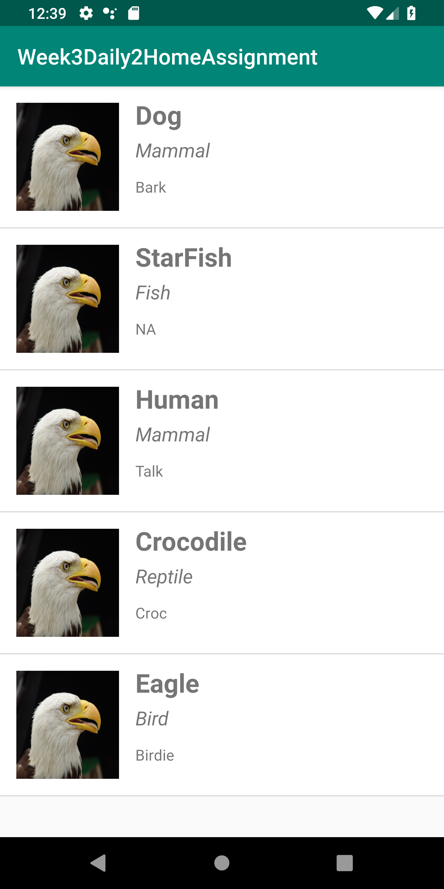
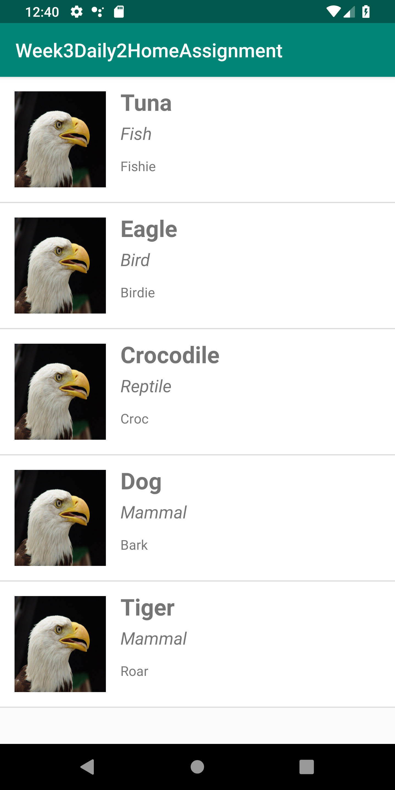

# Week3Daily2HomeAssignment
 Create an IntentService to create a list of random objects (The objects should have at least 4 fields including an image). Populate the recyclerView in the same activity which starts the intent service. Pass the data using a broadcast receiver.

random objects are being shown every time. Samples are given below:

